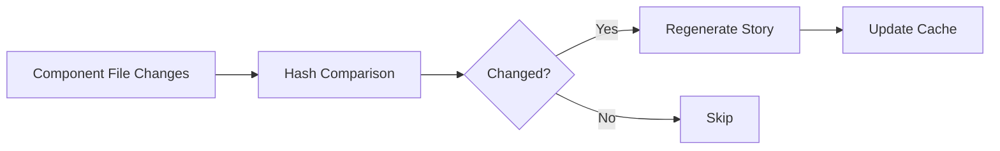

## Overview

Auto-sync monitors your component files and automatically updates stories when props change, ensuring your Storybook stays current with your codebase.

<Info>
  Auto-sync is perfect for CI/CD pipelines and pre-commit hooks
</Info>

## How It Works

Auto-sync uses file hashing to detect component changes:



## Using Auto-Sync

### CLI Mode

Monitor components and auto-sync:

```bash
npx storybook-mcp sync --watch
```

### One-Time Sync

Sync all components once:

```bash
npx storybook-mcp sync-all
```

### Sync Single Component

```bash
npx storybook-mcp sync src/components/Button.tsx
```

## Configuration

Configure sync behavior in `storybook-mcp.config.json`:

```json
{
  "sync": {
    "enabled": true,
    "updateExisting": true,
    "generateStories": true,
    "generateTests": true,
    "generateDocs": true,
    "watchMode": false
  }
}
```

<ParamField path="sync.enabled" type="boolean" default="true">
  Enable automatic syncing
</ParamField>

<ParamField path="sync.updateExisting" type="boolean" default="true">
  Update existing files when components change
</ParamField>

<ParamField path="sync.generateStories" type="boolean" default="true">
  Generate story files during sync
</ParamField>

<ParamField path="sync.generateTests" type="boolean" default="false">
  Generate test files during sync (Pro only)
</ParamField>

<ParamField path="sync.generateDocs" type="boolean" default="false">
  Generate MDX docs during sync (Pro only)
</ParamField>

<ParamField path="sync.watchMode" type="boolean" default="false">
  Continuously watch for changes
</ParamField>

## Cache Management

Auto-sync maintains a `.storybook-mcp-cache.json` file to track component hashes:

```json
{
  "src/components/Button.tsx": {
    "hash": "a1b2c3d4",
    "lastUpdated": "2025-01-15T10:30:00Z",
    "storyPath": "src/components/Button.stories.tsx"
  }
}
```

### Clear Cache

Force regeneration by clearing the cache:

```bash
rm .storybook-mcp-cache.json
npx storybook-mcp sync-all
```

## Pre-Commit Integration

Add to `.husky/pre-commit`:

```bash
#!/bin/sh
npx storybook-mcp sync-all --updateExisting
```

Or using `lint-staged`:

```json
{
  "lint-staged": {
    "src/**/*.tsx": [
      "npx storybook-mcp sync"
    ]
  }
}
```

## CI/CD Integration

### GitHub Actions

```yaml
name: Sync Stories
on: [push]
jobs:
  sync:
    runs-on: ubuntu-latest
    steps:
      - uses: actions/checkout@v3
      - run: npm install
      - run: npx storybook-mcp sync-all
      - uses: stefanzweifel/git-auto-commit-action@v4
        with:
          commit_message: 'chore: auto-sync stories'
```

### GitLab CI

```yaml
sync-stories:
  script:
    - npm install
    - npx storybook-mcp sync-all
    - git add .
    - git commit -m "chore: auto-sync stories" || true
    - git push
```

## Ignore Patterns

Exclude components from auto-sync:

```json
{
  "excludePatterns": [
    "**/legacy/**",
    "**/deprecated/**",
    "**/*.draft.tsx"
  ]
}
```

## Best Practices

<AccordionGroup>
  <Accordion icon="check" title="Sync regularly">
    Run sync before commits to keep stories fresh:
    ```bash
    npx storybook-mcp sync-all --updateExisting
    ```
  </Accordion>

  <Accordion icon="eye" title="Review changes">
    Always review auto-generated changes before committing.
  </Accordion>

  <Accordion icon="filter" title="Use selective sync">
    For large codebases, sync specific libraries:
    ```bash
    npx storybook-mcp sync-all --library=ui
    ```
  </Accordion>

  <Accordion icon="bolt" title="Dry-run first">
    Preview changes before writing:
    ```bash
    npx storybook-mcp sync-all --dryRun
    ```
  </Accordion>
</AccordionGroup>

## Performance

Auto-sync is optimized for large codebases:

- **Hash-based detection**: Only processes changed files
- **Parallel processing**: Syncs multiple components concurrently
- **Cache persistence**: Avoids redundant work

Typical performance:
- 100 components: ~5 seconds
- 500 components: ~20 seconds
- 1000+ components: ~45 seconds

## Troubleshooting

<AccordionGroup>
  <Accordion icon="circle-exclamation" title="Stories not updating">
    Clear cache and force sync:
    ```bash
    rm .storybook-mcp-cache.json
    npx storybook-mcp sync-all --updateExisting
    ```
  </Accordion>

  <Accordion icon="circle-exclamation" title="Sync skipping components">
    Check exclude patterns in config and verify component paths are correct.
  </Accordion>

  <Accordion icon="circle-exclamation" title="Permission errors in CI">
    Ensure CI has write permissions:
    ```yaml
    permissions:
      contents: write
    ```
  </Accordion>
</AccordionGroup>

## Related Tools

<CardGroup cols={2}>
  <Card title="sync_all" icon="arrows-rotate" href="/api-reference/sync-all">
    Sync all components at once
  </Card>
  <Card title="sync_component" icon="arrow-rotate-right" href="/api-reference/sync-component">
    Sync a single component
  </Card>
  <Card title="Configuration" icon="gear" href="/configuration">
    Configure sync behavior
  </Card>
  <Card title="CLI Flags" icon="terminal" href="/features/cli-flags">
    Command-line options
  </Card>
</CardGroup>
