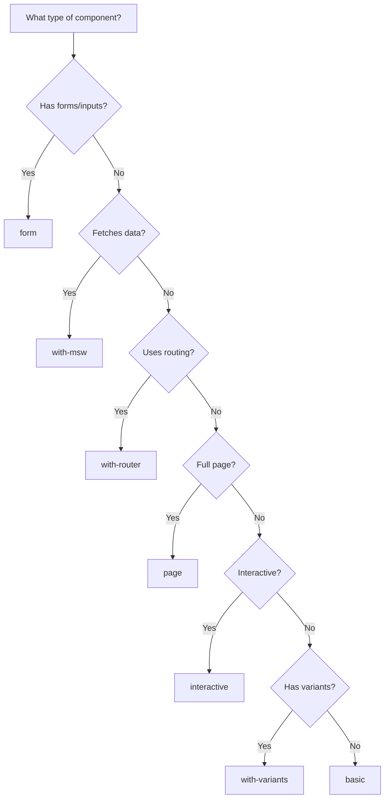

## Available Templates

Storybook MCP includes 7 production-ready templates:

<CardGroup cols={2}>
  <Card title="basic" icon="file" href="/templates/basic">
    Minimal story with single default example
  </Card>
  <Card title="with-variants" icon="grid-2" href="/templates/with-variants">
    Showcase all size/variant combinations (default)
  </Card>
  <Card title="with-msw" icon="server" href="/templates/with-msw">
    Mock API requests with Mock Service Worker
  </Card>
  <Card title="with-router" icon="route" href="/templates/with-router">
    Components using React Router
  </Card>
  <Card title="interactive" icon="hand-pointer" href="/templates/interactive">
    Play function tests for user interactions
  </Card>
  <Card title="form" icon="rectangle-list" href="/templates/form">
    Form components with validation and submission
  </Card>
  <Card title="page" icon="browser" href="/templates/page">
    Full page layouts with navigation and data
  </Card>
</CardGroup>

## Auto-Selection

When you don't specify a template, Storybook MCP intelligently selects based on component analysis:

| Component Pattern | Auto-Selected Template | Reason |
|-------------------|------------------------|---------|
| Has `onClick`, `onPress` | `interactive` | Needs interaction testing |
| Uses `useNavigate`, `Link` | `with-router` | Needs router context |
| Has `fetch`, `useSWR`, `useQuery` | `with-msw` | Needs API mocking |
| Has `onSubmit`, form validation | `form` | Form-specific patterns |
| Imports from `layouts/`, full viewport | `page` | Page-level component |
| Has `size`, `variant`, `colorScheme` | `with-variants` | Needs variant showcase |
| Default | `with-variants` | General purpose |

## Usage

### Auto-Select Template

Let Storybook MCP choose:

```bash
npx storybook-mcp sync src/components/Button.tsx
```

### Explicit Template

Specify a template:

```json
{
  "componentPath": "src/components/LoginForm.tsx",
  "template": "form"
}
```

### Override in Config

Set default template per library:

```json storybook-mcp.config.json
{
  "libraries": [
    {
      "name": "ui",
      "path": "src/components",
      "defaultTemplate": "with-variants"
    },
    {
      "name": "forms",
      "path": "src/forms",
      "defaultTemplate": "form"
    }
  ]
}
```

## Template Features

<Tabs>
  <Tab title="basic">
    ### When to Use
    - Proof of concept
    - Simple components with minimal props
    - Design system tokens (colors, spacing)

    ### What's Included
    - ✅ Single default story
    - ✅ Minimal imports
    - ✅ Fast to generate

    ### What's Missing
    - ❌ No variants
    - ❌ No interactions
    - ❌ No tests

    [View Details →](/templates/basic)
  </Tab>

  <Tab title="with-variants">
    ### When to Use
    - UI component libraries
    - Design systems
    - Components with size/variant props

    ### What's Included
    - ✅ Default story
    - ✅ Size variations (sm, md, lg)
    - ✅ Variant combinations (solid, outline, ghost)
    - ✅ Color scheme options
    - ✅ Disabled states

    ### Framework-Specific
    - Chakra: Uses `Stack` layout
    - Tamagui: Uses `YStack` with theme tokens
    - shadcn: Uses Tailwind utilities

    [View Details →](/templates/with-variants)
  </Tab>

  <Tab title="with-msw">
    ### When to Use
    - Components fetching data
    - API integrations
    - Loading/error states

    ### What's Included
    - ✅ MSW handlers for API mocking
    - ✅ Loading state story
    - ✅ Success state story
    - ✅ Error state story
    - ✅ Empty state story
    - ✅ Proper delays and realistic data

    ### Requirements
    - `msw` installed
    - MSW addon configured in Storybook

    [View Details →](/templates/with-msw)
  </Tab>

  <Tab title="with-router">
    ### When to Use
    - Components using `useNavigate`, `useParams`
    - Link components
    - Navigation menus

    ### What's Included
    - ✅ React Router provider decorator
    - ✅ Initial route configuration
    - ✅ Multiple route examples
    - ✅ Navigation interaction tests

    ### Requirements
    - `react-router-dom` installed
    - Storybook router addon

    [View Details →](/templates/with-router)
  </Tab>

  <Tab title="interactive">
    ### When to Use
    - Buttons, menus, modals
    - Components with event handlers
    - User interaction flows

    ### What's Included
    - ✅ Play function tests
    - ✅ Click interactions
    - ✅ Keyboard navigation
    - ✅ Focus management
    - ✅ Assertions

    ### Requirements
    - `@storybook/test` installed
    - Interactions addon

    [View Details →](/templates/interactive)
  </Tab>

  <Tab title="form">
    ### When to Use
    - Form inputs
    - Form containers
    - Components with validation

    ### What's Included
    - ✅ Default values
    - ✅ Validation errors
    - ✅ Submit handling
    - ✅ Loading states
    - ✅ Accessibility labels

    ### Framework Support
    - React Hook Form
    - Formik
    - Vanilla controlled inputs

    [View Details →](/templates/form)
  </Tab>

  <Tab title="page">
    ### When to Use
    - Full page layouts
    - Dashboard views
    - Multi-component compositions

    ### What's Included
    - ✅ Full viewport parameters
    - ✅ Navigation structure
    - ✅ Data mocking
    - ✅ Responsive layouts
    - ✅ Accessibility checks

    ### Best Practices
    - Mock all data dependencies
    - Include loading states
    - Test responsive breakpoints

    [View Details →](/templates/page)
  </Tab>
</Tabs>

## Combining Templates

<Warning>
  Templates cannot be combined. Choose the most appropriate template for your component's primary purpose.
</Warning>

However, you can manually add features from other templates:

```typescript
// Start with with-variants template
// Then manually add MSW handlers from with-msw template
import { http, HttpResponse } from 'msw'

export const WithData: Story = {
  args: {
    size: 'md',
    variant: 'solid',
  },
  parameters: {
    msw: {
      handlers: [
        http.get('/api/data', () => {
          return HttpResponse.json({ data: 'example' })
        }),
      ],
    },
  },
}
```

## Custom Templates

<Info>
  Pro users can create custom templates. See [Custom Templates](/templates/custom) for details.
</Info>

Quick example:

```typescript
// .storybook-mcp-templates/my-template.ts
import { Template } from 'storybook-mcp'

export const myTemplate: Template = {
  name: 'my-template',
  description: 'Custom template for X pattern',
  generate: (component) => {
    return `
import type { Meta, StoryObj } from '@storybook/react'
import { ${component.name} } from './${component.name}'

// ... your template code
`
  },
}
```

Then use:

```json
{
  "componentPath": "src/components/MyComponent.tsx",
  "template": "my-template"
}
```

## Template Selection Guide

Use this flowchart to choose the right template:



## Best Practices

<AccordionGroup>
  <Accordion icon="magic-wand-sparkles" title="Let auto-selection work">
    Start with auto-selection and override only when needed:
    ```bash
    npx storybook-mcp sync src/components/Button.tsx
    ```
  </Accordion>

  <Accordion icon="eye" title="Preview with dry-run">
    Check which template will be used:
    ```json
    {
      "componentPath": "src/components/Button.tsx",
      "dryRun": true
    }
    ```
  </Accordion>

  <Accordion icon="pen" title="Customize after generation">
    Generate with a template, then manually tweak:
    1. Generate story with template
    2. Review generated code
    3. Add custom stories or modifications
    4. Don't regenerate (would overwrite)
  </Accordion>

  <Accordion icon="book" title="Document your choice">
    Add comments explaining template choice:
    ```typescript
    // Using 'with-msw' template because this component
    // fetches user data from /api/users
    ```
  </Accordion>
</AccordionGroup>

## Related

<CardGroup cols={2}>
  <Card title="generate_story" icon="wand-magic-sparkles" href="/api-reference/generate-story">
    Story generation API
  </Card>
  <Card title="Frameworks" icon="palette" href="/features/frameworks">
    Framework-specific features
  </Card>
  <Card title="Examples" icon="folder" href="https://github.com/yourusername/storybook-mcp/tree/main/examples">
    Real-world examples
  </Card>
  <Card title="Custom Templates" icon="code" href="/templates/custom">
    Build your own (Pro)
  </Card>
</CardGroup>
